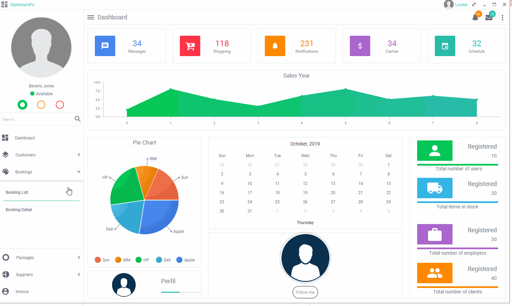
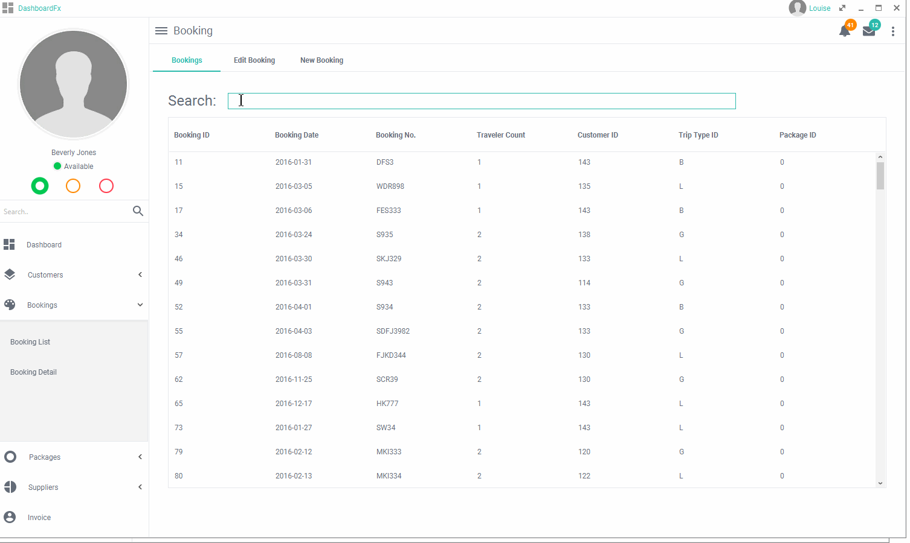
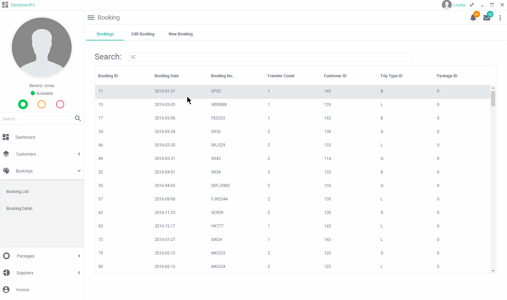
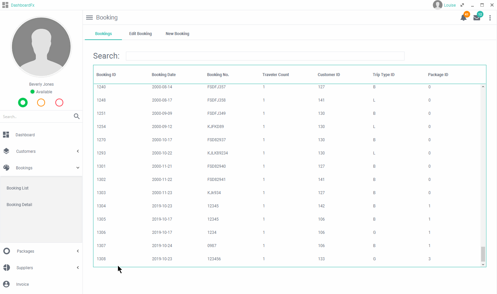
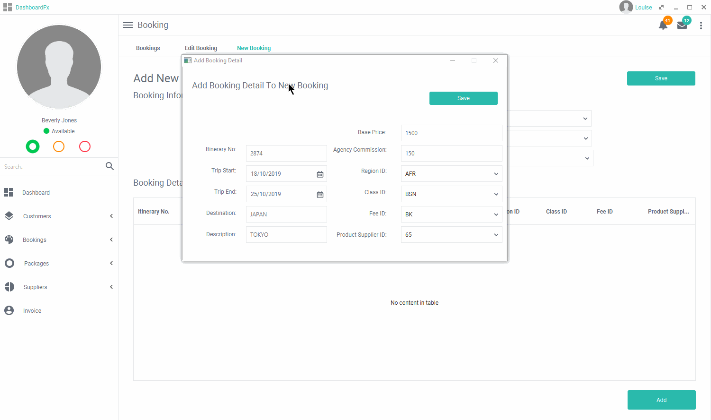

# Travel Experts Application

A Desktop Application to administer data for a travel agency. Data stored on the database can be administered using this application where users will be able to view and modify the data.

## Before using
Application must connect to Travel Experts Database in MySQL. Run the sql script included (travelexperts.sql)

## Take A Peak
</img>

## Search
</img>

## Update
</img>

## Delete
</img>

## Add
</img>

## Built With

* LANGUAGE: JAVA
* DATABASE: MYSQL

## Authors

* **Louise Acosta** - Booking, Booking Details, Invoice, UI Design (except dashboard)
* **Liming Hong** - Package, Supplier
* **Hayley Mead** - Customer
* **Colin Lee-Chee** - Invoice Database Connection

## Acknowledgments

* Gleidson Neves da Silveira - Dashboard Template
